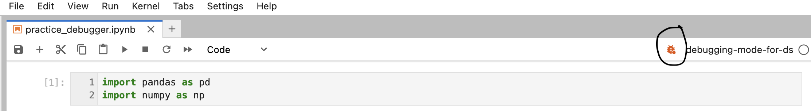
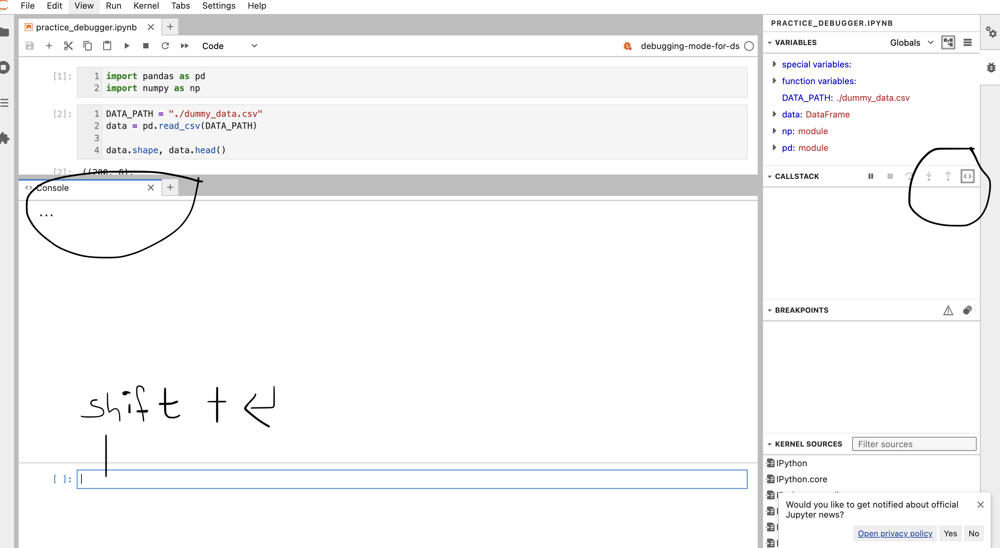
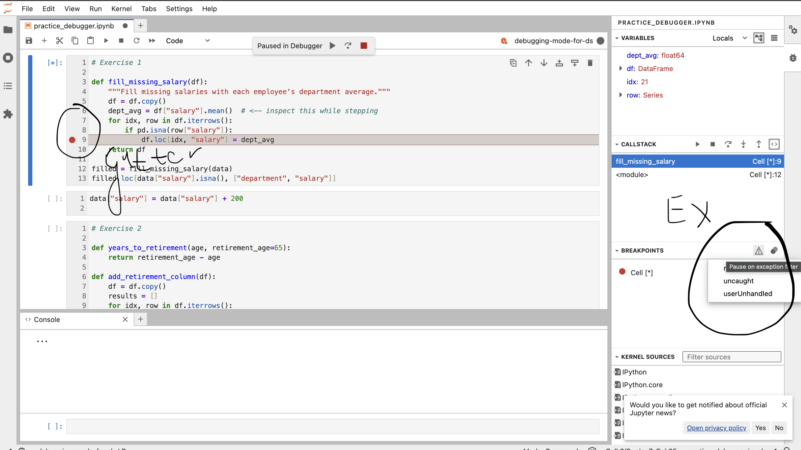
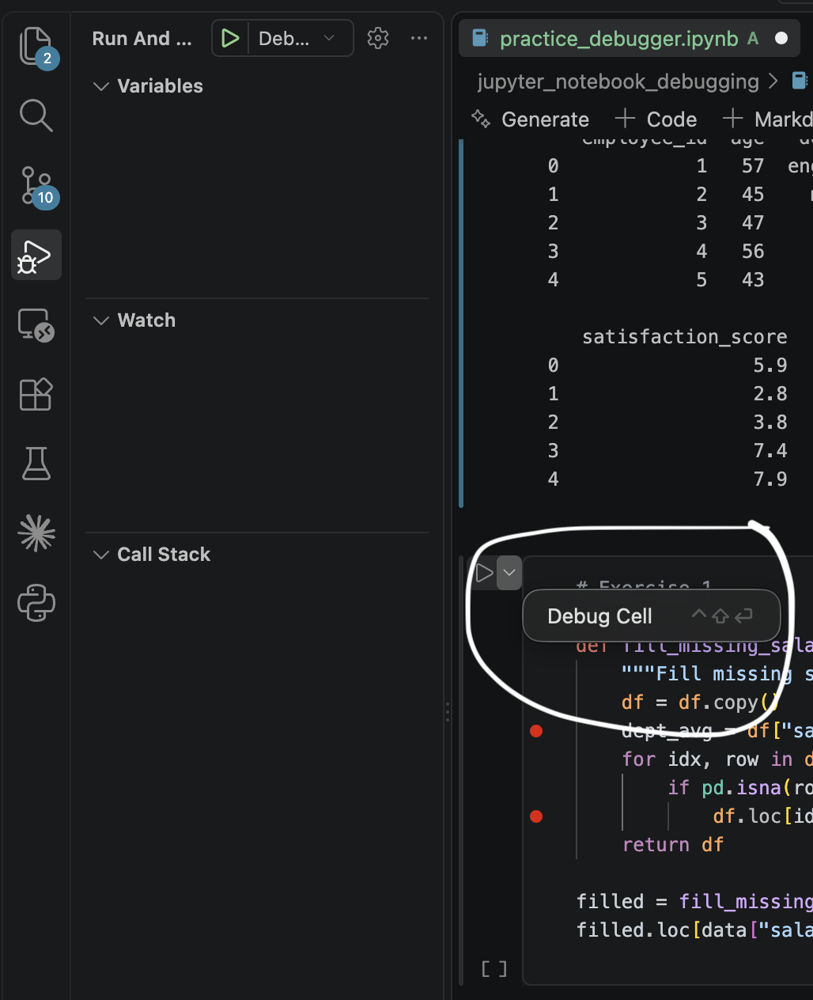
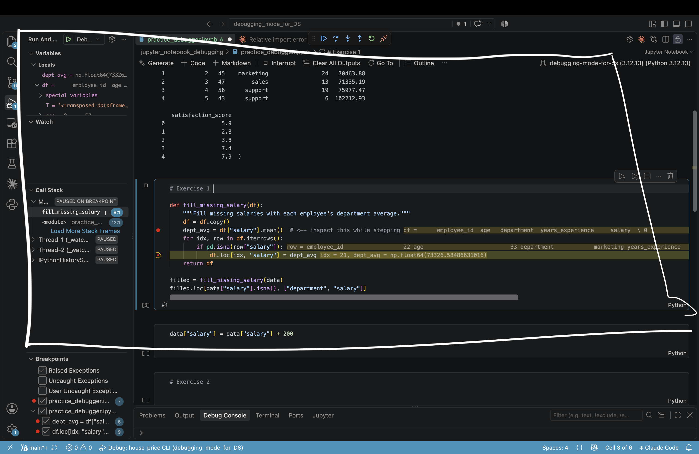

## Debugging mode in Jupyter notebook

There are plenty of options to enable debugging in Jupyter notebook.

There are some really cool talks about short and long routes in these videos 

1) https://www.youtube.com/watch?v=1b9fq7-xesI - The presenter starts with "long route" which makes this video more appreciable
2) https://www.youtube.com/watch?v=rSPyvPw0p9k
3) https://www.youtube.com/watch?v=3qNgX3QtmuE&t

**Note** In this exploration only visual debugger with jupyter notebook is explored

There are other methods or enchanced debugging ways like pdb, %debug and ipyflow which is not explored.
Please refer to the videos or ask Claude to teach you.

### Using the VSCode analogous breakpoints route in jupyter notebook

A simple way to kick-off is to enable the "bug icon" on the notebook

Some quirks when using debugger on Jupyter notebook

1) If you have your notebook instance set up on localhots, F5 key will refresh your browser as opposed to moving to next breakpoint. Use F9 instead

2) Debug console is kinda hidden. Click on CALL STACK -  <> icon
Shift + Enter to actaully evaluate your expressions

3) Place the gutter on your line of interest and run it as usual. Leverage exceptions as required

**Note** - The version of jupyter lab you are running can affect UI and you may see different options that=n the one you are seeing here. My current version is 4.6.4

**Note** The steps to run debugger on notebooks via VSCode is a mix of both VSCode debugging setup and notebook setup.

1) Select the Kernel
2) Place the gutters
3) Run Debug Cell instead of Run Cell

4) Inspect as usual 

