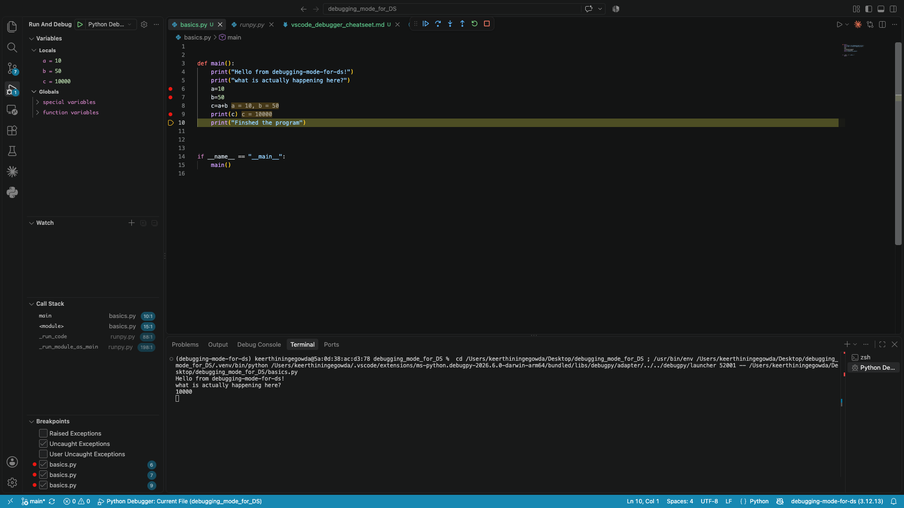

# Debugger mode cheatseet

A debugger basically freezes a running program at the moment a dev would choose and lets you inspect it. Everything else is variation on the tool. The mental model that is quite important to have for this tool is
<i> It is not a tool that will magically fix bugs for you, but helps you to pause and inspect your code</i>

### Core loop
1) Pick a line where you want to knoe what's true. Click to the right of the line number - you'll see a red dot. 
2) F5. The program runs normally ans tops there. This step should also spin up the Run and Debug floating window to your left otherwise something is wrong in your vscode settings.

Your view should look something similar to this. I changed the value of c from debug console

3) Inspect the variables pane, teh call stack and any other breakpoints you have set 
4) Additionally inspect Debug Console which gives REPL interface which helps you to inteact/inspect with the variables. 
 🚨 Keep in mind that the making changes to variables from the console is not read-only/ It affects the rest of the execution 🚨 
5) F10 to run the next line, F5 to continue to next breakpoint. You can also use the floating toolbar at the top of the screen for this

<ul>
<b>Some important shortcuts</b>
<li>F5 - Start the deubgging mode or continue to next breakpoint</li>
<li>F9 - toggle breakpoint</li>
<li>F10 - Step over (run the current line, but don't go inside)</li>
<li>F11 - Step into (go inside the function on this line)</li>
</ul>

### Some quirks to get the setup right
1) F5 on mac is by default is enabled for dictation. So change your keyboard settings to use function keys for F5 as a shortcut to kick-off a debugger
2) By default VS Code ships with justMyCode: true, which means you cannot step into library code most of the times. To change this 
a) You'll need a .vscode/launch.json. For this Cmd_Shift_P -> "Debug:Add Configuration"
b) In that generated file, find or add the line "justMyCode": true
c) Save and go on as usual